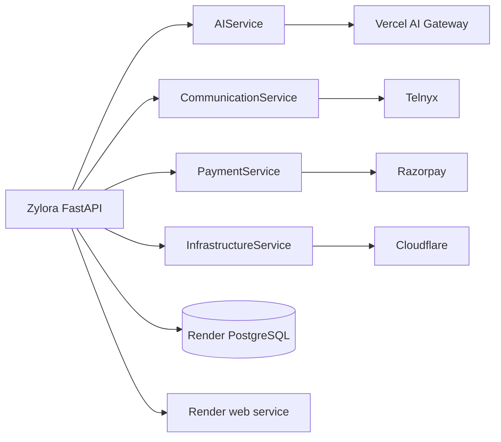

# Zylora V1 production provider architecture

## Decision

Zylora has four canonical external API-provider relationships:

1. **Vercel AI Gateway** for hosted model inference through `AIService`.
2. **Telnyx** for transactional email and WhatsApp through `CommunicationService`.
3. **Razorpay** for customer payments and entitlement webhooks through `PaymentService`.
4. **Cloudflare** for custom-domain infrastructure, Turnstile when enabled, and R2-compatible media when enabled through the existing infrastructure/media boundary.

Render is the hosting platform and PostgreSQL is the production database. They are infrastructure dependencies, not additional API-provider relationships. The application currently has no Redis runtime dependency; `REDIS_URL` remains an optional compatibility setting and must not be provisioned solely because historical deployment notes mentioned it.

## Provider boundaries

### Vercel AI Gateway

Feature modules call `app.ai_service.ai_service`. The service resolves models from `app.ai_models`/the gateway registry and delegates transport to `VercelAIGatewayAdapter`. Credit reservation, usage settlement, refunds, and idempotency remain server-side. `LegacyOpenAIAdapter` is retained only for local/test compatibility; it is not selected when `APP_ENV=production`.

### Telnyx

`EmailService` selects Telnyx whenever `TELNYX_API_KEY` is configured. `CommunicationService` owns the adapter boundary, webhook verification, and normalized delivery results. Resend, SMTP, Twilio, and direct Meta paths are compatibility/test surfaces only and are not required when Telnyx is configured.

### Razorpay

Payment routes use the existing `PaymentService`/Razorpay facade. Order creation, signature verification, webhook replay protection, subscription state, and entitlements remain server-authoritative. `PAYMENT_PROVIDER=mock` is retained for local/test operation; production paid billing uses Razorpay credentials.

### Cloudflare

The existing Cloudflare facade owns domain/DNS lifecycle and Turnstile verification. Media can use the existing S3-compatible service with Cloudflare R2 credentials; no second storage provider is introduced. Tokens remain server-only.

## Optional integrations

- Google OAuth is feature-optional. Set `GOOGLE_OAUTH_ENABLED=true` only when the OAuth client is configured.
- Turnstile is feature-optional. Set `TURNSTILE_ENABLED=false` for a deployment that intentionally does not use it; when enabled, server validation remains mandatory.
- Penpot is inactive and fail-closed for V1 while `STUDIO_ENGINE=legacy`.

## Runtime safety

Production startup rejects SQLite, weak development database credentials, missing gateway configuration, and invalid enabled-feature credentials. Error messages contain variable names only; secret values are never included. Already-published sites are rendered by Zylora and do not depend on an AI, communication, payment, Cloudflare control-plane, or Penpot request being available at request time.
